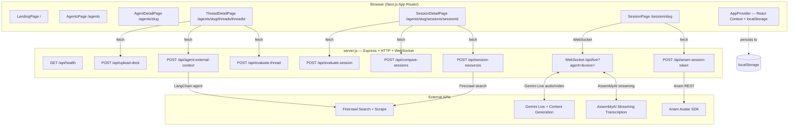
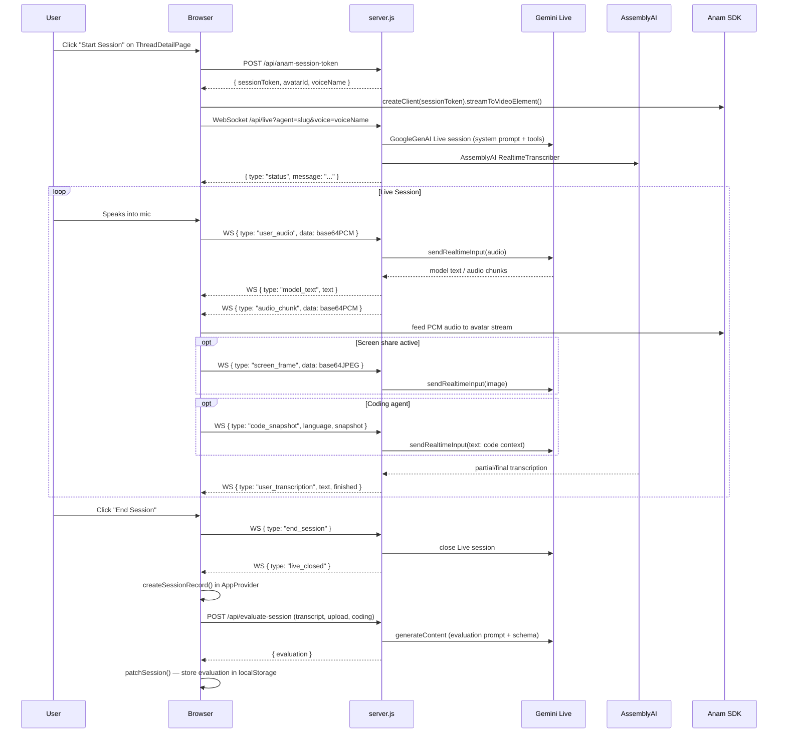
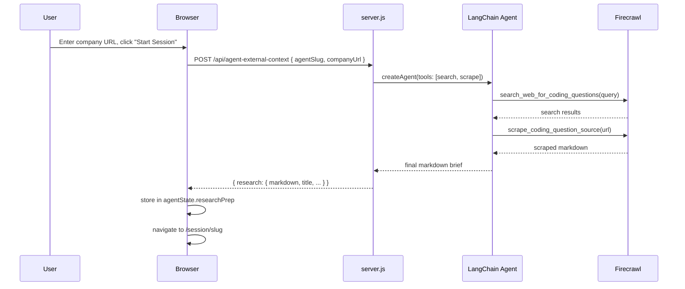

# Design Document: PitchMirror — Live AI Rehearsal Platform

## Overview

PitchMirror is a Next.js 15 application that provides live AI rehearsal rooms for high-stakes scenarios: coding interviews, investor pitches, academic presentations, recruiter screens, and custom sessions. Users practice with a live AI avatar (Anam) that speaks and reacts in real time, powered by Gemini Live for audio AI and AssemblyAI for user transcription.

The app is a faithful replica of the reference implementation in `TeamNotNull_InnovationHacks/`. It is built as a single deployable unit: a custom Express + HTTP server (`server.js`) that serves the Next.js frontend and handles all API routes and WebSocket connections. There is no database, no authentication, and no Redis — all state lives in the browser via React Context backed by `localStorage`.

The new app is placed in a `sim-coach/` folder at the workspace root.

## Architecture



## Sequence Diagrams

### Session Flow



### External Research Flow (Coding / Investor / Custom agents)



## Components and Interfaces

### Component 1: server.js

**Purpose**: Single-file Express server that serves Next.js, handles all API routes, and runs the WebSocket bridge between the browser and Gemini Live / AssemblyAI.

**Key responsibilities**:
- Serve Next.js via `next()` request handler
- Handle all `/api/*` HTTP routes
- Upgrade `/api/live` requests to WebSocket connections
- Bridge browser audio/video to Gemini Live API
- Bridge AssemblyAI transcription back to browser
- Run LangChain agent for external research
- Call Gemini for evaluation, thread evaluation, comparison, and resource curation

**Environment variables**:
```
GEMINI_API_KEY                    # fallback for all tasks
GEMINI_LIVE_API_KEY               # optional, for live sessions
GEMINI_QUESTION_FINDER_API_KEY    # optional, for external research
GEMINI_EVALUATION_API_KEY         # optional, for evaluation
GEMINI_RESOURCE_CURATION_API_KEY  # optional, for resource curation
GEMINI_UPLOAD_PREP_API_KEY        # optional, for PDF upload
ASSEMBLYAI_API_KEY
ANAM_API_KEY
FIRECRAWL_API_KEY
NEXT_PUBLIC_BACKEND_HTTP_URL      # optional, for separate deployments
NEXT_PUBLIC_BACKEND_WS_URL        # optional, for separate deployments
```

### Component 2: AppProvider (components/app-provider.js)

**Purpose**: React Context provider that manages all client-side state and persists it to `localStorage`. No server-side state storage.

**State shape**:
```javascript
{
  theme: "dark" | "light",
  agents: {
    [slug]: {
      upload: { status, fileName, previewUrl, contextText, error },
      sessionName: string,
      threadName: string,
      customContextText: string,
      companyUrl: string,
      researchPrep: { status, result, error },
      selectedThreadId: string,
      session: { status, muted, lastEndedAt, lastDurationLabel },
      evaluation: { score, metrics },
      rating: number,
    }
  },
  threads: {
    [slug]: Thread[]
  },
  sessions: {
    [slug]: Session[]
  }
}
```

**Key actions**:
- `patchAgent(slug, updater)` — update agent-level state
- `patchSession(slug, sessionId, updater)` — update a session record
- `patchThread(slug, threadId, updater)` — update a thread record
- `createThread(slug, title)` — create a new thread
- `selectThread(slug, threadId)` — set active thread
- `createSessionRecord(slug, sessionData)` — save a completed session
- `deleteSession(slug, sessionId)` — remove session and cancel jobs
- `deleteThread(slug, threadId)` — remove thread and all its sessions
- `requestResourceFetch(slug, sessionId)` — trigger resource job
- `requestSessionComparison(slug, sessionId, baselineId)` — trigger comparison job
- `runEvaluationJob(session)` — POST to /api/evaluate-session, store result
- `runResourceJob(session)` — POST to /api/session-resources, store result
- `runComparisonJob(session, baselineId)` — POST to /api/compare-sessions, store result
- `runThreadEvaluationJob(slug, threadId)` — POST to /api/evaluate-thread, store result

### Component 3: SessionPage (components/session-page.js)

**Purpose**: The live session room. Handles mic capture, WebSocket connection to server, Anam avatar streaming, AssemblyAI transcription display, screen sharing, code editor, and Picture-in-Picture.

**Key behaviors**:
- Requests microphone via `getUserMedia`
- Opens WebSocket to `/api/live?agent=slug&voice=voiceName`
- Sends `session_context` message on connect (upload, thread memory, research, custom context)
- Captures mic audio via `AudioContext + ScriptProcessor`, downsamples to 16kHz PCM, sends as base64
- Receives `audio_chunk` messages (24kHz PCM from Gemini), downsamples to 16kHz, feeds to Anam avatar
- Receives `model_text` for live transcript display
- Receives `user_transcription` from AssemblyAI relay
- For coding agent: sends `code_snapshot` messages (debounced 3s) when code changes
- For screen-share agents: captures frames at 1.2s intervals via canvas, sends as `screen_frame` JPEG
- On `end_session`: calls `createSessionRecord()` in AppProvider, navigates to agent detail page
- Picture-in-Picture via `documentPictureInPicture` API for screen share sessions

**Audio pipeline**:
```
getUserMedia → AudioContext → ScriptProcessor (4096 samples)
  → downsample Float32 to 16kHz → floatTo16BitPCM → base64
  → WS { type: "user_audio", data, mimeType: "audio/pcm;rate=16000" }

WS { type: "audio_chunk", data: base64 24kHz PCM }
  → base64 → Uint8Array → Int16Array → downsample to 16kHz
  → Anam audioStream.addPCM16(samples)
```

### Component 4: WebSocket Handler in server.js

**Purpose**: Bridges browser audio/video to Gemini Live and AssemblyAI transcription back to browser.

**Message protocol (browser → server)**:
```javascript
{ type: "session_context", customContext, threadContext, companyUrl, externalResearch, upload }
{ type: "get_history" }
{ type: "user_audio", data: base64PCM, mimeType: "audio/pcm;rate=16000" }
{ type: "screen_frame", data: base64JPEG, mimeType: "image/jpeg", surface }
{ type: "screen_share_state", active: bool, surface }
{ type: "code_snapshot", language, snapshot }
{ type: "end_session" }
```

**Message protocol (server → browser)**:
```javascript
{ type: "status", message }
{ type: "model_text", text }
{ type: "audio_chunk", data: base64PCM }
{ type: "user_transcription", text, finished: bool }
{ type: "live_closed", message }
{ type: "error", message }
```

**Server-side flow**:
1. Parse `?agent=` and `?voice=` from URL
2. Look up agent config from `AGENT_LOOKUP`
3. Create Gemini Live session with agent system prompt + voice
4. Create AssemblyAI RealtimeTranscriber
5. On `session_context`: build full system prompt with context, send to Gemini
6. On `user_audio`: forward PCM to Gemini `sendRealtimeInput`
7. On `screen_frame`: forward JPEG to Gemini `sendRealtimeInput`
8. On `code_snapshot`: send code as text context to Gemini
9. On Gemini `audio`: relay as `audio_chunk` to browser
10. On Gemini `text`: relay as `model_text` to browser
11. On AssemblyAI transcript: relay as `user_transcription` to browser
12. On `end_session`: close Gemini session, close AssemblyAI, send `live_closed`

### Component 5: API Routes

**POST /api/anam-session-token**
- Calls Anam REST API to create a session token
- Picks a random avatar profile from `ANAM_AVATAR_PROFILES` (8 profiles)
- Picks a matching voice from `GEMINI_VOICE_BY_GENDER`
- Returns `{ sessionToken, avatarId, voiceName, avatarName }`

**POST /api/upload-deck**
- Accepts `multipart/form-data` with field `deck` (PDF)
- Parses PDF with `pdf-parse`
- Sends extracted text to Gemini (`uploadPrep` task key) for cleaning/summarization
- Returns `{ contextText, contextPreview, fileName }`

**POST /api/agent-external-context**
- Accepts `{ agentSlug, companyUrl, customContext, upload }`
- Runs LangChain agent with Firecrawl search + scrape tools
- For `coding` agent: finds a grounded coding interview question
- For `investor` agent: builds investor diligence brief
- For `custom` agent: gathers general web context
- Returns `{ research: { markdown, title, companyName, ... } }`

**POST /api/evaluate-session**
- Accepts `{ agentSlug, sessionId, transcript, upload, coding, customContext, ... }`
- Builds evaluation prompt from transcript + agent-specific rubric
- Calls Gemini with structured JSON schema response
- Normalizes result against agent's `evaluationCriteria`
- Returns `{ evaluation: { score, summary, metrics, strengths, improvements, recommendations, resourceBriefs } }`

**POST /api/evaluate-thread**
- Accepts `{ agentSlug, thread, sessions[] }`
- Builds longitudinal analysis prompt from all session evaluations
- Calls Gemini with structured JSON schema response
- Returns `{ threadEvaluation: { summary, trajectory, comments, strengths, focusAreas, nextSessionFocus, metricTrends, hiddenGuidance } }`

**POST /api/compare-sessions**
- Accepts `{ agentSlug, currentSession, baselineSession }`
- Calls Gemini to compare two evaluation results
- Returns `{ comparison: { trend, summary, metrics[] } }`

**POST /api/session-resources**
- Accepts `{ agentSlug, sessionId, resourceBriefs[] }`
- For each brief: runs two Firecrawl searches (video + article), deduplicates, optionally scrapes, curates with Gemini
- Returns `{ topics: [{ id, topic, whyThisMatters, items: [{ title, url, type, source, reason }] }] }`

## Data Models

### Thread (client-side only)

```javascript
{
  id: string,           // "thread-{timestamp}-{random}"
  agentSlug: string,
  title: string,
  createdAt: ISO string,
  updatedAt: ISO string,
  sessionIds: string[],
  evaluation: {
    status: "idle" | "processing" | "completed" | "failed",
    result: ThreadEvaluationResult | null,
    error: string,
  },
  memory: {
    hiddenGuidance: string,   // injected into next session's system prompt
    summary: string,
    focusAreas: string[],
    updatedAt: ISO string,
  }
}
```

### Session (client-side only)

```javascript
{
  id: string,           // "session-{timestamp}-{random}"
  agentSlug: string,
  agentName: string,
  threadId: string,
  sessionName: string,
  startedAt: ISO string,
  endedAt: ISO string,
  durationLabel: string,  // "MM:SS"
  transcript: [{ id, role, text, live }],
  upload: { fileName, contextText } | null,
  externalResearch: { markdown, title, ... } | null,
  customContext: string,
  coding: {
    language: string,
    companyUrl: string,
    interviewQuestion: { title, markdown, companyName, sourceUrl } | null,
    finalCode: string,
  } | null,
  evaluation: {
    status: "processing" | "completed" | "failed",
    result: EvaluationResult | null,
    error: string,
  },
  resources: {
    status: "idle" | "processing" | "completed" | "failed",
    briefs: ResourceBrief[],
    topics: ResourceTopic[],
    error: string,
  },
  comparison: {
    status: "idle" | "processing" | "completed" | "failed",
    baselineSessionId: string,
    result: ComparisonResult | null,
    error: string,
  }
}
```

### EvaluationResult

```javascript
{
  score: number,          // 0–100
  summary: string,
  metrics: [{ label, value, justification }],
  strengths: string[],
  improvements: string[],
  recommendations: string[],
  resourceBriefs: [{
    id, topic, improvement, whyThisMatters,
    searchPhrases: string[], resourceTypes: string[]
  }]
}
```

### Agent Config (data/agents.js)

Each agent has:
```javascript
{
  slug: string,
  name: string,
  role: string,
  duration: string,
  description: string,
  longDescription: string,
  scenario: string,
  focus: string[],
  flow: string[],
  previewMetrics: [{ label, value }],
  contextFieldLabel: string,
  contextFieldDescription: string,
  screenShareTitle?: string,
  screenShareHelperText?: string,
  screenShareEmptyText?: string,
  screenShareInstruction?: string,
  evaluationCriteria: [{ label, description }],
  systemPrompt: string,
  evaluationPrompt: string,
  mockEvaluation: { score, metrics, summary, strengths, improvements },
  codingLanguages?: string[],         // coding agent only
  codingQuestionBank?: Question[],    // coding agent only
  sessionKickoff?: string,            // coding agent only
}
```

**5 agents**: `professor`, `recruiter`, `investor`, `coding`, `custom`

## Frontend Pages

### / — LandingPage
Hero section with CTA to `/agents`. Three-step "How a session feels" panel.

### /agents — AgentsPage
Grid of 5 agent cards. Each card shows role badge, duration pill, name, description, focus chips.

### /agents/[slug] — AgentDetailPage
- Agent info: name, description, scenario, evaluation criteria grid
- Thread management: create new thread (requires thread name), list existing threads
- Each thread shows session count, last updated, evaluation summary if available

### /agents/[slug]/threads/[threadId] — ThreadDetailPage
- Thread overview: session count, average score
- Create Session form: session name (required), custom context textarea, company URL (coding/investor/custom), PDF upload
- Thread Evaluation panel: trajectory, next session focus, metric trends, strengths, focus areas, hidden memory
- Past Sessions list: links to session detail pages

### /agents/[slug]/sessions/[sessionId] — SessionDetailPage
- Session info: agent, file, thread link, custom context, external research brief
- Coding workspace (coding agent): language, company URL, interview question markdown, final code
- Evaluation: score, metric cards with progress bars and justification, strengths, improvements, recommendations
- Improvement Resources: fetch-on-demand via Firecrawl, grouped by topic with accordion
- Session Comparison: select baseline session, compare delta metrics
- Transcript: scrollable, expandable

### /session/[slug] — SessionPage
- Live session room with Anam avatar video
- Transcript panel (live + finalized entries)
- Mic mute/unmute control
- Timer
- End Session button
- For coding agent: CodeMirror editor with language selector, sync status indicator
- For screen-share agents: screen share panel with start/stop, preview video, PiP button

## Key Frontend Features

### CodeMirror Integration
- Languages: JavaScript (jsx), Python, Java, C++, SQL, Pseudocode (plain)
- Extensions: `EditorView.lineWrapping` always included
- Debounced code snapshots: 3-second debounce, only sends if code changed since last send
- Sync states: `idle` | `typing` | `synced` | `waiting`

### Screen Sharing
- `getDisplayMedia({ video: { frameRate: { ideal: 5, max: 8 } } })`
- Frame capture: canvas `drawImage` → `toDataURL("image/jpeg", 0.72)` → base64
- Capture interval: 1200ms
- Surface detection: `browser` → `tab`, `window` → `window`, `monitor` → `screen`
- PiP: `documentPictureInPicture.requestWindow({ width: 360, height: 420 })`

### Theme Toggle
- Dark/light via `data-theme` attribute on `<html>`
- CSS custom properties for all colors
- Persisted in `localStorage` via AppProvider

### Toast Notifications
- Auto-dismiss after 4 seconds
- Shown for: evaluation ready, resources ready, comparison ready

## Error Handling

### WebSocket
- On `live_closed`: session phase → "ended", trigger cleanup
- On `error`: session phase → "error", show error message
- No automatic reconnection (session is considered ended)

### Evaluation / Resources / Comparison Jobs
- Each job uses an `AbortController` stored in a `useRef` Map
- Jobs are cancelled when session/thread is deleted
- Failed jobs show error state with retry option (resources only)

### Anam Avatar
- If `createClient()` or `streamToVideoElement()` fails, session continues without avatar
- No explicit fallback UI — avatar area shows empty video element

### PDF Upload
- Multer stores to `uploads/` directory
- On parse failure: returns 500 with error message
- File is deleted after processing (not persisted)

## Testing Strategy

### Unit Tests
- Agent config validation (all 5 agents have required fields)
- `buildTranscriptText()` formatting
- `normalizeEvaluationResult()` score clamping
- `pickRandomAnamProfile()` always returns valid profile + voice

### Integration Tests
- POST /api/evaluate-session with mock Gemini response
- POST /api/upload-deck with sample PDF
- WebSocket connection and message routing with mock Gemini Live

### Property-Based Tests (fast-check)
- Evaluation score always clamped to [0, 100] for any raw Gemini output
- `deriveResourceBriefs()` always returns 0–2 briefs for any evaluation shape
- Thread evaluation always produces required fields for any session array

## Dependencies

```json
{
  "@anam-ai/js-sdk": "^4.12.0",
  "@codemirror/lang-cpp": "^6.0.3",
  "@codemirror/lang-java": "^6.0.2",
  "@codemirror/lang-javascript": "^6.2.5",
  "@codemirror/lang-python": "^6.2.1",
  "@codemirror/lang-sql": "^6.10.0",
  "@codemirror/language": "^6.12.2",
  "@codemirror/state": "^6.6.0",
  "@codemirror/view": "^6.40.0",
  "@google/genai": "^1.46.0",
  "@langchain/google-genai": "^2.1.26",
  "@uiw/react-codemirror": "^4.25.8",
  "assemblyai": "^4.28.0",
  "buffer": "^6.0.3",
  "cors": "^2.8.6",
  "cross-env": "^10.1.0",
  "dotenv": "^17.3.1",
  "express": "^5.2.1",
  "langchain": "^1.3.0",
  "multer": "^2.1.1",
  "next": "^15.3.1",
  "pdf-parse": "^2.4.5",
  "react": "^19.1.0",
  "react-dom": "^19.1.0",
  "ws": "^8.19.0",
  "zod": "^4.3.6"
}
```
